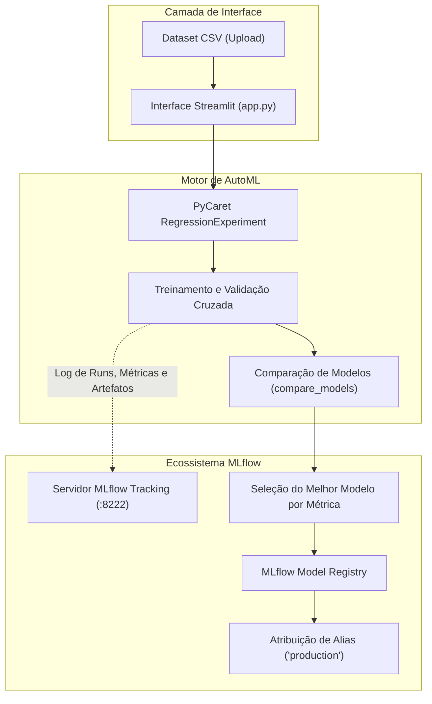

# Pipeline AutoML com MLflow (PoC)

Prova de Conceito prática avaliando a viabilidade técnica da integração de pipelines do PyCaret (AutoML) com o MLflow (Tracking e Model Registry)

[](https://www.python.org/)
[](https://pycaret.org/)
[](https://mlflow.org/)
[](https://streamlit.io/)
[](https://www.docker.com/)

## Contexto e Motivação (Iniciação Científica - UFJF)

Este repositório documenta um protótipo de Prova de Conceito (PoC) desenvolvido durante um projeto de pesquisa de **Iniciação Científica (IC)** na **Universidade Federal de Juiz de Fora (UFJF)**.

### Objetivo Arquitetural da PoC
Avaliar se seria viável utilizar o **MLflow** integrado ao **PyCaret** para que o ecossistema do MLflow (especificamente o Tracking de experimentos e o Model Registry) fosse introduzido na arquitetura de uma **API de treinamento e seleção automática de modelos** que estava sendo desenvolvida no grupo de pesquisa. \
Essa API tornou-se a [AutoMLOps](https://github.com/eduardaac/AutoMLOps), desenvolvida por [eduardaac](https://github.com/eduardaac).

### Critérios de Avaliação Técnica
1. **Rastreamento Automatizado de Experimentos:** Validar se a instrumentação nativa do PyCaret repassa hiperparâmetros, artefatos de pipeline e métricas de avaliação a um servidor central do MLflow sem atritos.
2. **Promoção de Modelos no Model Registry:** Validar a consulta programática da melhor execução com base em métricas de regressão configuráveis ($R^2$, RMSE, MAE) e o registro do modelo campeão com aliases/tags operacionais (ex: `production`).

## Arquitetura e Fluxo de Execução

O pipeline integra a ingestão de dados tabulares, o treinamento automatizado via PyCaret e o gerenciamento de ciclo de vida no MLflow:



---

## Funcionalidades

- **Comparação Automatizada de Modelos:** Treinamento, validação e ranqueamento automático de múltiplos algoritmos de regressão (Random Forest, LightGBM, Linear Regression, Ridge, CatBoost, etc.) via PyCaret.
- **Rastreamento de Experimentos em Tempo Real:** Registro automático de hiperparâmetros, métricas de regressão ($R^2$, RMSE, MAE, MSE) e modelos treinados no servidor MLflow.
- **Promoção para o Model Registry:** Seleção dinâmica da melhor execução com base na métrica definida pelo usuário e publicação no registro de modelos do MLflow com alias de produção.
- **Interface Web Minimalista:** Aplicação interativa em Streamlit para upload do dataset, seleção de target e acompanhamento do status do pipeline.
- **Ambiente Containerizado:** Orquestração completa via Docker Compose com serviços desacoplados para o frontend Streamlit e o servidor MLflow.

---

## Estrutura do Projeto

```text
autotrain-to-mlflow/
├── app.py                      # Interface de usuário em Streamlit
├── ml_utils.py                 # Módulo de treinamento PyCaret e integração MLflow
├── data/
│   └── boston_weather_data.csv # Dataset de exemplo para testes de regressão
├── docker-compose.yml          # Orquestração de containers (MLflow Server + Streamlit)
├── Dockerfile                  # Construção da imagem Docker da aplicação Streamlit
├── pyproject.toml              # Metadados e dependências do projeto gerenciadas via Poetry
├── poetry.lock                  
├── .gitignore                  
└── README.md                  
```

---

## Como Executar

Você pode executar o projeto de duas formas: utilizando **Docker Compose** (recomendado, sem necessidade de configurar ambiente Python local) ou **localmente via Poetry**.

### Opção A: Execução via Docker Compose (Recomendado)

Requisitos: [Docker](https://docs.docker.com/get-docker/) e [Docker Compose](https://docs.docker.com/compose/) instalados.

1. **Clone o repositório:**
   ```bash
   git clone https://github.com/pedroalmeid/autotrain-to-mlflow.git
   cd autotrain-to-mlflow
   ```

2. **Inicie os serviços:**
   ```bash
   docker compose up --build
   ```

3. **Acesse as interfaces:**
   - **Aplicação Streamlit:** [http://localhost:8501](http://localhost:8501)
   - **Painel do MLflow:** [http://localhost:8222](http://localhost:8222)

---

### Opção B: Execução Local com Poetry

Requisitos: **Python 3.11** e [Poetry](https://python-poetry.org/) instalados.

1. **Clone o repositório:**
   ```bash
   git clone https://github.com/pedroalmeid/autotrain-to-mlflow.git
   cd autotrain-to-mlflow
   ```

2. **Instale as dependências do projeto:**
   ```bash
   poetry install
   ```

3. **Inicie o servidor do MLflow em um terminal:**
   ```bash
   poetry run mlflow server \
       --host 127.0.0.1 \
       --port 8222 \
       --backend-store-uri sqlite:///mlruns/mlflow.db \
       --default-artifact-root ./mlartifacts
   ```

4. **Inicie a aplicação Streamlit em outro terminal:**
   ```bash
   poetry run streamlit run app.py
   ```

5. Acesse a aplicação no navegador em [http://localhost:8501](http://localhost:8501).

---

## Testando com o Dataset de Exemplo

O repositório inclui um dataset de teste localizado em `data/boston_weather_data.csv`:

1. Abra a interface do Streamlit em [http://localhost:8501](http://localhost:8501).
2. Clique em **Browse files** e faça o upload do arquivo `data/boston_weather_data.csv`.
3. Visualize a prévia dos dados e selecione a coluna alvo para predição (ex: `tavg` para temperatura média).
4. Clique em **Train & Compare Models** para iniciar a comparação automatizada do PyCaret.
5. Após a conclusão do treinamento:
   - Verifique a lista de modelos avaliados e o modelo selecionado como melhor candidato.
   - Escolha a métrica de avaliação desejada para o registro (ex: `R2`).
   - Defina o alias ou tag desejada (ex: `production`).
   - Clique em **Register Model to MLflow**.
6. Acesse o painel do **MLflow** em [http://localhost:8222](http://localhost:8222) para inspecionar as execuções, métricas, artefatos gerados e o modelo versionado no Model Registry.

---

## Variáveis de Ambiente

As configurações da aplicação podem ser ajustadas via variáveis de ambiente:

| Variável | Valor Padrão | Descrição |
|---|---|---|
| `MLFLOW_TRACKING_URI` | `http://localhost:8222` | URI do servidor de rastreamento do MLflow |
| `USE_GPU` | `false` | Habilita aceleração por GPU no PyCaret (`true` ou `false`) |
| `DEFAULT_EXPERIMENT_NAME` | `reg-autotrain` | Nome do experimento no MLflow para salvar as execuções |
| `DEFAULT_MODEL_NAME` | `autotrainstreamlit` | Nome do modelo a ser utilizado no MLflow Model Registry |

---

## Autor e Contato

**Desenvolvido por Pedro Almeida**

- LinkedIn: [linkedin.com/in/pedroalmeid](https://www.linkedin.com/in/pedroalmeid)
- GitHub: [github.com/pedroalmeid](https://github.com/pedroalmeid)
- Portfólio: [pedroalmeid.github.io/portfolio](https://pedroalmeid.github.io/portfolio)
- E-mail: [pedrojos.campos@protonmail.com](mailto:pedrojos.campos@protonmail.com)

---

## Licença

Este projeto está sob a licença [MIT](LICENSE) - consulte o arquivo LICENSE para obter detalhes.
